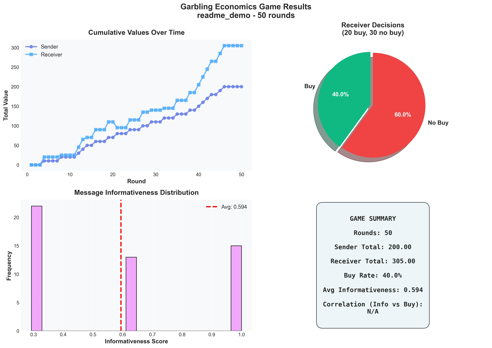

# Garbling Gym

**An extensible experiment framework for garbling economics and Bayesian persuasion**

[](https://www.python.org/downloads/)
[](https://opensource.org/licenses/MIT)

> *"More information is always better for a single decision-maker, but strategic senders often benefit from partial revelation."* — Blackwell's Informativeness Theorem & Bayesian Persuasion

---

## Table of Contents

- [Overview](#overview)
- [What is Garbling?](#what-is-garbling)
- [How a Single Round Works](#how-a-single-round-works)
- [Installation](#installation)
- [Quick Start](#quick-start)
- [Command Reference](#command-reference)
- [Experiments & Configuration](#experiments--configuration)
- [Visualization & Analysis](#visualization--analysis)
- [LLM Integration](#llm-integration)
- [Design Directions](#design-directions)
- [Project Structure](#project-structure)
- [Economic Concepts](#economic-concepts)
- [References](#references)

---

## Overview

**Garbling Gym** is a research and education tool for exploring **information economics**, **Bayesian persuasion**, and **strategic information disclosure**. It implements an interactive game where:

- A **Sender** observes asset quality and chooses how to "garble" (add noise to) the information
- A **Receiver** observes the garbled signal and decides whether to buy
- Both agents can use **LLM-powered reasoning** or **heuristic Bayesian strategies**

The framework enables:
- 🎮 **Interactive simulations** with configurable agents
- 📊 **Comprehensive analysis** of information quality and outcomes
- 🔬 **Batch experiments** with parameter sweeps
- 📈 **Rich visualizations** (ASCII, HTML, interactive dashboards)
- 🤖 **LLM integration** via pydantic-ai for agent reasoning
- 💾 **Persistent storage** with SQLite indexing for fast queries

### Example Results



*Visualization of a 50-round game showing cumulative values, receiver decisions, message informativeness distribution, and game summary.*

---

## What is Garbling?

### Formal Definition

**Garbling** is adding "noise" to information, making it less informative. An information structure σ is **garbled** to produce σ' if there exists a stochastic matrix Γ such that:

```
σ' = Γσ
```

The matrix Γ is the **garbling matrix**, where each row is a probability distribution over output signals.

### Example: Pooling Strategies

**Perfect Information (Identity Matrix):**
```
         Signal→  BAD   NEUTRAL  GOOD
Quality↓
LOW              1.0     0.0     0.0
MEDIUM           0.0     1.0     0.0
HIGH             0.0     0.0     1.0
```

**Garbled Information (Pooling LOW with MEDIUM):**
```
         Signal→  BAD   NEUTRAL  GOOD
Quality↓
LOW              0.5     0.5     0.0    ← Pooled
MEDIUM           0.5     0.5     0.0    ← Pooled
HIGH             0.0     0.0     1.0    ← Still revealed
```

### Blackwell's Informativeness Theorem

> **Theorem (Blackwell, 1951):** The following are equivalent:
> 1. σ is more informative than σ' (σ' = Γσ for some garbling Γ)
> 2. Any expected utility maximizer weakly prefers σ to σ'
> 3. The feasible set of posterior distributions under σ' ⊆ those under σ

This creates a **partial ordering** over information structures: the **Blackwell order**.

**Key Insight:** More information is always better for receivers, but senders with misaligned interests can benefit from strategic garbling.

---

## How a Single Round Works

A game consists of `num_rounds` sequential rounds (default: 20). Each round follows seven steps:

```
┌─────────┐      ┌────────┐      ┌──────────────┐      ┌──────────┐      ┌──────────┐
│ 1.Nature │─────>│2.Sender│─────>│ 3.Garbling   │─────>│4.Receiver│─────>│5.Payoffs │
│ draws    │      │ picks  │      │   matrix     │      │ observes │      │ computed │
│ quality  │      │strategy│      │ samples      │      │ signal,  │      │          │
│          │      │        │      │ signal       │      │ decides  │      │          │
└─────────┘      └────────┘      └──────────────┘      └──────────┘      └──────────┘
  LOW/MED/HIGH    e.g.             np.random.choice       BUY/PASS       (action,quality)
  from prior     "pool_low_medium" from matrix row        from signal     → payoff pair
```

### Step by step

1. **Nature draws quality.** A true asset quality (LOW, MEDIUM, or HIGH) is sampled from the prior distribution (default: 30%/40%/30%) using `random.choices`. This is hidden from the receiver.

2. **Sender chooses a garbling strategy.** The sender knows the true quality and the full history of past rounds. It selects one of the 6 built-in strategies by name (e.g., `"pool_low_medium"`). In heuristic mode, this is a weighted random choice conditioned on quality and recent receiver payoffs. In LLM mode, this is an API call that returns a structured `StrategyChoice`.

3. **The garbling matrix samples a signal.** The chosen strategy's 3×3 stochastic matrix is looked up. The row corresponding to the true quality gives a probability distribution over signals. A single signal (BAD, NEUTRAL, or GOOD) is sampled from that row via `np.random.choice`. For example, if the quality is LOW and the strategy is `aggressive_pooling`, the row `[0.3, 0.4, 0.3]` gives a 30% chance of GOOD — misleading the receiver.

4. **Receiver observes the signal and decides.** The receiver sees **only** the signal token — not the true quality, not which strategy was used. It also has access to the full history of past rounds (including true qualities revealed post-hoc). It decides BUY or PASS. In heuristic mode, this is a Bayesian pipeline: estimate P(signal|quality) from history, compute posterior via Bayes' rule, calculate expected value, apply a sigmoid decision threshold. In LLM mode, this is an API call returning a structured `ActionChoice`.

5. **Payoffs are computed.** The payoff depends on (action, true quality). The sender earns +10 on any BUY and 0 on any PASS — regardless of quality. The receiver earns -15 (BUY+LOW), +5 (BUY+MEDIUM), +20 (BUY+HIGH), or 0 (PASS).

6. **Cumulative totals are updated.** Both agents' running payoff totals are incremented.

7. **The round is recorded.** A complete record — quality, strategy name, informativeness score, signal, action, both payoffs — is appended to the game history. Both agents can see this in subsequent rounds.

### What each agent knows

| Agent | At decision time | After the round |
|-------|-----------------|-----------------|
| Sender | True quality, full prior history | Everything (already knew quality) |
| Receiver | Signal token only, full prior history | True quality is revealed post-hoc |

The post-hoc revelation is key: the receiver learns whether it was deceived after each round, enabling it to calibrate trust in future signals.

### The signal channel

The entire communication from sender to receiver is **one of three discrete tokens** per round: BAD, NEUTRAL, or GOOD (~1.58 bits maximum). There is no continuous value, no natural language, no partial disclosure. The sender's expressive power is limited to choosing which of 6 pre-defined probability distributions to sample from.

---

## Installation

### Prerequisites

- **Python 3.10+**
- **uv** (recommended) or pip

### Basic Installation

```bash
# Clone the repository
git clone https://github.com/yourusername/garbling-sims.git
cd garbling-sims

# Install with uv (recommended)
uv sync

# Or with pip
pip install -e .
```

### With LLM Support

```bash
# Install with OpenAI integration
uv sync --extra llm

# Configure API key (create .env file)
echo "OPENAI_API_KEY=sk-your-key-here" > .env
```

See [LLM_SETUP.md](LLM_SETUP.md) for detailed LLM configuration.

---

## Quick Start

### Run Your First Game

```bash
# Simple 10-round game with heuristic agents
gg run --rounds 10 --name "first_game"

# With LLM agents (requires API key)
gg run --rounds 10 --llm --name "llm_game"

# View detailed results
gg visualize first_game
```

### Example Output

```
======================================================================
GARBLING ECONOMICS GAME
======================================================================

Rounds: 10

Round  1 | Quality: HIGH   | Strategy: slight_noise    | Signal: GOOD | Action: BUY  | Payoffs: +10/+20
Round  2 | Quality: LOW    | Strategy: pool_low_medium | Signal: BAD  | Action: PASS | Payoffs:   0/  0
...

📊 OVERALL RESULTS:
   Sender Total Payoff:   +80
   Receiver Total Payoff: +95
   Buy Rate:              70.0%

📉 INFORMATION QUALITY:
   Avg Informativeness:   0.58 (0=noise, 1=perfect)
   Receiver Regret:       +25 (loss from garbling)
```

### Browse Past Experiments

```bash
# List recent runs
gg list-runs

# Filter and sort
gg list-runs --sort sender_total --limit 20
gg list-runs --filter-name "baseline"

# Compare two runs
gg compare run1 run2 --detail
```

---

## Command Reference

### `gg run` - Execute Single Game

Run a single garbling economics game.

```bash
gg run [OPTIONS]

Options:
  -r, --rounds INTEGER        Number of rounds (default: 20)
  -c, --config PATH          Config file (YAML or Python)
  -n, --name TEXT            Experiment name
  --llm/--no-llm             Use LLM agents (requires API key)
  --llm-model TEXT           Model to use (default: gpt-4o-mini)
  -v/-q, --verbose/--quiet   Output verbosity
  --save/--no-save           Save results (default: save)

Examples:
  gg run                              # Basic game with defaults
  gg run --rounds 50 --name "test"    # 50 rounds, named run
  gg run --config exp.yaml            # Load from config file
  gg run --llm --llm-model gpt-4o     # Use GPT-4
```

### `gg list-runs` - Browse Experiments

List and filter past experiment runs.

```bash
gg list-runs [OPTIONS]

Options:
  -l, --limit INTEGER                 Max runs to show (default: 20)
  --sort [timestamp|name|sender_total|receiver_total|rounds]
  --filter-name TEXT                  Filter by name pattern
  --min-sender FLOAT                  Minimum sender total
  --max-sender FLOAT                  Maximum sender total
  --llm/--no-llm                      Filter by LLM usage

Examples:
  gg list-runs                        # Show 20 recent runs
  gg list-runs --limit 50             # Show 50 runs
  gg list-runs --sort sender_total    # Sort by sender payoff
  gg list-runs --filter-name base     # Filter by name
  gg list-runs --llm                  # Show only LLM runs
```

### `gg experiment` - Batch Experiments

Run batch experiments from YAML configuration.

```bash
gg experiment [OPTIONS] EXPERIMENT_FILE

Options:
  -p, --parallel          Run experiments in parallel (experimental)
  -t, --tag TEXT          Add tags to all runs (multiple allowed)
  --dry-run               Preview without executing

Examples:
  gg experiment experiments/sweep.yaml
  gg experiment experiments/ablation.yaml --tag "ablation-v1"
  gg experiment large_run.yaml --dry-run  # Preview first
```

**Experiment File Format:**
```yaml
experiments:
  - name: baseline
    rounds: 20
    llm: false
    tags: [baseline]

  - name: llm_sender
    rounds: 20
    llm: true
    llm_roles: [sender]
    tags: [llm, sender-only]
```

### `gg visualize` - Detailed Analysis

Display detailed ASCII visualizations and statistics.

```bash
gg visualize [OPTIONS] [RUN_ID]

Options:
  -s, --section [summary|bayesian|all]  Sections to show (default: all)
  -e, --export PATH                     Export to file

Examples:
  gg visualize                          # Most recent run
  gg visualize 2026-02-04_120000_test   # Specific run
  gg visualize --section summary        # Summary only
  gg visualize --export report.txt      # Export to file
```

### `gg compare` - Compare Runs

Compare two runs side-by-side.

```bash
gg compare [OPTIONS] RUN_ID_1 RUN_ID_2

Options:
  -d, --detail    Show detailed round-by-round comparison

Examples:
  gg compare run1 run2
  gg compare run1 run2 --detail
```

### `gg export` - Static Reports

Export results to HTML or CSV.

```bash
gg export [OPTIONS] RUN_ID

Options:
  -f, --format [html|csv|all]  Export format (default: html)
  -o, --output PATH            Output path

Examples:
  gg export run_id                      # HTML report
  gg export run_id --format csv         # CSV data files
  gg export run_id --format all         # Both formats
  gg export run_id -o ~/reports/        # Custom location
```

### `gg serve` - Interactive Dashboards

Launch Marimo interactive web dashboards.

```bash
gg serve [OPTIONS]

Options:
  -m, --mode [dashboard|run|edit]  Dashboard mode (default: dashboard)
  -r, --run-id TEXT                Specific run to visualize
  -p, --port INTEGER               Server port (default: 2718)
  --host TEXT                      Bind host (default: localhost)
  --no-browser                     Don't open browser

Examples:
  gg serve                             # Launch dashboard
  gg serve --mode run                  # Run visualization
  gg serve --port 8080                 # Custom port
  gg serve --mode edit                 # Edit notebooks
```

---

## Experiments & Configuration

### YAML Configuration

**Simple Config** (`experiments/yaml/baseline.yaml`):
```yaml
name: baseline
num_rounds: 20
use_llm: false

prior:
  LOW: 0.3
  MEDIUM: 0.4
  HIGH: 0.3

payoffs:
  BUY_HIGH: 20
  BUY_MEDIUM: 5
  BUY_LOW: -15
  PASS: 0
  SENDER_BUY: 10
  SENDER_PASS: 0
```

**Parameter Sweep** (`experiments/yaml/sweep.yaml`):
```yaml
experiments:
  - name: rounds_10
    rounds: 10
    llm: false

  - name: rounds_20
    rounds: 20
    llm: false

  - name: rounds_50
    rounds: 50
    llm: false
```

### Python Configuration

**Advanced Config** (`experiments/python/custom.py`):
```python
from garbling_gym.core.config import GameConfig
from garbling_gym.core.strategies import GarblingStrategy
from garbling_gym.core.strategies.registry import strategy_registry
import numpy as np

# Define custom garbling strategy
custom_matrix = np.array([
    [0.8, 0.15, 0.05],  # LOW → mostly BAD
    [0.2, 0.6,  0.2],   # MEDIUM → mostly NEUTRAL
    [0.0, 0.1,  0.9],   # HIGH → mostly GOOD
])

custom_strategy = GarblingStrategy(
    matrix=custom_matrix,
    name="custom_moderate_garbling"
)

# Register strategy
strategy_registry.register("custom_moderate", custom_strategy)

# Configure game
config = GameConfig(
    num_rounds=30,
    use_llm=False,
    prior={"LOW": 0.3, "MEDIUM": 0.4, "HIGH": 0.3}
)
```

### Built-in Strategies

The framework includes several pre-built garbling strategies:

| Strategy | Informativeness | Description |
|----------|----------------|-------------|
| `full_revelation` | 1.0 | Perfect information (identity matrix) |
| `slight_noise` | 0.64 | Small noise, mostly truthful |
| `pool_low_medium` | 0.29 | Pool LOW and MEDIUM together |
| `pool_medium_high` | 0.29 | Pool MEDIUM and HIGH together |
| `aggressive_pooling` | 0.09 | Pool all three into two signals |
| `complete_noise` | 0.0 | Completely uninformative |

---

## Visualization & Analysis

### ASCII Visualizations

Built-in terminal visualizations show:
- **Strategy distribution** with bar charts
- **Cumulative payoffs** over time
- **Information quality impact** on outcomes
- **Blackwell ordering analysis**
- **Economic welfare** calculations
- **Bayesian updating** analysis with posterior probabilities

```bash
gg visualize run_id
```

### HTML Reports

Self-contained HTML reports with:
- Gradient metric cards
- Interactive tables
- Round-by-round timeline
- Quality distribution charts
- Embedded CSS (no external dependencies)

```bash
gg export run_id --format html
open run_results/run_id/exports/report.html
```

### CSV Data Export

Machine-readable data for analysis:
- `*_rounds.csv`: Round-by-round data
- `*_summary.csv`: Aggregate statistics
- `*_quality.csv`: Quality distribution
- `*_strategies.csv`: Strategy usage

```bash
gg export run_id --format csv
```

### Interactive Dashboards

Marimo-powered interactive dashboards:

**Dashboard Mode** - Browse all experiments:
- Filter by tags and LLM usage
- Multi-select runs for comparison
- Interactive Plotly charts
- Aggregate statistics

**Run Mode** - Deep dive into single run:
- Cumulative payoff charts
- Strategy and quality distributions
- Round-by-round data table

```bash
gg serve  # Dashboard at http://localhost:2718
```

---

## LLM Integration

### What the LLM Does — and Does Not Do

The LLM powers agent **decision-making**, not the garbling itself. This is an important distinction:

| Step | Heuristic mode | LLM mode |
|------|---------------|----------|
| Sender picks strategy | Weighted random choice based on quality + history | LLM API call → structured `StrategyChoice` |
| **Garbling (signal generation)** | **Matrix sample via `np.random.choice`** | **Matrix sample via `np.random.choice`** |
| Receiver decides action | Bayesian pipeline → sigmoid → stochastic | LLM API call → structured `ActionChoice` |

The garbling step is identical in both modes. The LLM never crafts, modulates, or transmits the signal. It decides *which matrix to use* (sender) and *how to react to a discrete token* (receiver). Two API calls per round, zero of which touch the information transformation.

### Setup

```bash
# Install LLM dependencies
uv sync --extra llm

# Configure API key in .env
echo "OPENAI_API_KEY=sk-your-key-here" > .env
```

### Usage

```bash
# Use LLM agents
gg run --llm

# Specify model
gg run --llm --llm-model gpt-4o

# Batch experiment with LLM
gg experiment experiments/yaml/llm_sweep.yaml
```

### Architecture

- **Structured outputs** via pydantic-ai — sender returns one of 6 strategy names, receiver returns BUY or PASS
- **Graceful fallback** to heuristic agents if API is unavailable or call fails
- **Cost efficient** (~$0.0001 per round with gpt-4o-mini)
- Both agents receive the last 5 rounds of history as context, plus system prompts explaining the game theory

See [LLM_SETUP.md](LLM_SETUP.md) for detailed documentation.

---

## Design Directions

### LLM-as-Garbler: Natural Language Persuasion

The current architecture treats garbling as a mathematical operation (matrix sampling). A natural extension is to make the LLM the garbling mechanism itself — replacing the matrix channel with natural language communication.

**Current flow (matrix garbling):**
```
Quality → Sender picks matrix → np.random.choice → discrete token (BAD/NEUTRAL/GOOD) → Receiver
```

**Proposed flow (LLM garbling):**
```
Quality → Sender LLM writes natural language message → free-form text → Receiver LLM → BUY/PASS
```

In this model, the sender crafts a message about the asset (knowing the true quality), and the receiver reads that message and decides. The garbling *is* the language — what gets emphasized, omitted, framed, or spun. This is closer to real-world persuasion: a seller describing a car, an analyst writing a research note, a company's earnings call.

### Why Both Modes Have Value

| Dimension | Matrix Mode | LLM-as-Garbler Mode |
|-----------|------------|---------------------|
| **Models** | Information-theoretic channel | Natural language persuasion |
| **Measurability** | Exact (informativeness from matrix) | Requires proxy metrics |
| **Reproducibility** | Deterministic given seed | Stochastic, model-dependent |
| **Signal space** | 3 discrete tokens | Unbounded text |
| **Research question** | "Given a known information structure, how do rational agents behave?" | "How well can an LLM strategically persuade another LLM?" |

### Open Questions

- **Sender constraints:** Word count limits? Required templates? Unconstrained free text?
- **Measuring garbling:** Without a matrix, how do you quantify informativeness? Options include evaluator LLMs, empirical receiver accuracy, or embedding-space analysis.
- **Architecture:** A `GarblingChannel` interface that both `GarblingStrategy` (matrix) and a future `LLMGarblingChannel` implement, keeping the game loop identical.

---

## Project Structure

```
garbling-sims/
├── src/garbling_gym/
│   ├── core/                    # Core game logic
│   │   ├── game.py             # Main game loop
│   │   ├── config.py           # Configuration
│   │   ├── agents/             # Agent implementations
│   │   │   ├── base.py         # Base agent class
│   │   │   ├── llm.py          # LLM agent base
│   │   │   ├── sender.py       # Sender agent
│   │   │   ├── receiver.py     # Receiver agent
│   │   │   └── registry.py     # Agent factory
│   │   ├── strategies/         # Garbling strategies
│   │   │   ├── base.py         # Strategy base class
│   │   │   ├── builtin.py      # Built-in strategies
│   │   │   └── registry.py     # Strategy registry
│   │   ├── storage.py          # Results storage
│   │   ├── database.py         # SQLite indexing
│   │   └── types.py            # Domain types
│   │
│   ├── cli/                    # Command-line interface
│   │   ├── __main__.py         # CLI entry point
│   │   ├── config.py           # Config loading
│   │   └── commands/           # CLI commands
│   │       ├── run.py
│   │       ├── list.py
│   │       ├── experiment.py
│   │       ├── visualize.py
│   │       ├── compare.py
│   │       ├── export.py
│   │       └── serve.py
│   │
│   ├── exports/                # Export formats
│   │   ├── base.py             # Exporter interface
│   │   ├── html.py             # HTML reports
│   │   └── csv.py              # CSV data
│   │
│   ├── visualization/          # Visualization tools
│   │   └── ascii.py            # Terminal visualizations
│   │
│   └── web/                    # Web interfaces
│       └── notebooks/          # Marimo notebooks
│           ├── dashboard.py    # Browse experiments
│           └── run_visualization.py  # Run analysis
│
├── experiments/                # Experiment configs
│   ├── yaml/                   # YAML configs
│   └── python/                 # Python configs
│
├── tests/                      # Test suite
│   ├── core/                   # Unit tests
│   ├── integration/            # Integration tests
│   └── cli/                    # CLI tests
│
├── run_results/                # Experiment results
│   └── YYYY-MM-DD_HHMMSS_name/
│       ├── config.yaml
│       ├── results.json
│       ├── metadata.json
│       ├── artifacts/
│       └── exports/
│
├── pyproject.toml              # Project config
├── README.md                   # This file
├── LLM_SETUP.md               # LLM documentation
└── .env                        # Environment variables (gitignored)
```

---

## Economic Concepts

### Information Economics

**Core Question:** How does information structure affect decision-making and welfare?

**Key Findings:**
1. More information always benefits receivers (when free)
2. Senders can benefit from strategic partial revelation
3. Garbling creates a trade-off between sender profit and social welfare

### Bayesian Persuasion

Formalized by **Kamenica & Gentzkow (2011)**:
- Sender commits to information structure before learning state
- Receiver observes signal and updates beliefs via Bayes' rule
- Sender chooses structure to maximize expected payoff

**Applications:**
- Advertising and product reviews
- Financial disclosure
- Political campaigns
- Medical test design

### Blackwell Ordering

Establishes when one information structure is "more informative" than another:
- **Reflexive:** σ ≥ σ (every structure as informative as itself)
- **Transitive:** σ ≥ σ' and σ' ≥ σ'' implies σ ≥ σ''
- **Partial:** Not all pairs can be compared

**Informativeness Score:**
```python
# Measures "distance" from perfect information (identity matrix)
informativeness = 1 - (||Γ - I|| / ||uniform - I||)
```

### Welfare Analysis

**Metrics tracked:**
- **Sender surplus:** Total sender payoffs
- **Receiver surplus:** Total receiver payoffs
- **Social welfare:** Sum of both
- **Receiver regret:** Loss vs. perfect information
- **Deadweight loss:** Efficiency loss from garbling

---

## Testing

### Run Tests

```bash
# All tests
uv run pytest -v

# With coverage
uv run pytest --cov=garbling_gym --cov-report=html

# Specific test file
uv run pytest tests/core/test_strategies.py -v

# Integration tests only
uv run pytest tests/integration/ -v
```

### Test Structure

- **Unit tests** (`tests/core/`): Test individual components
- **Integration tests** (`tests/integration/`): Test complete workflows
- **CLI tests** (`tests/cli/`): Test command-line interface

**Coverage:** 70 tests, 38% overall coverage (46% on core modules)

---

## References

### Foundational Papers

1. **Blackwell, D. (1951).** "Comparison of Experiments." *Proceedings of the Second Berkeley Symposium on Mathematical Statistics and Probability*, 93-102.

2. **Blackwell, D. (1953).** "Equivalent Comparisons of Experiments." *Annals of Mathematical Statistics*, 24, 265-272.

3. **Kamenica, E., & Gentzkow, M. (2011).** "Bayesian Persuasion." *American Economic Review*, 101(6), 2590-2615.

4. **Bergemann, D., & Morris, S. (2019).** "Information Design: A Unified Perspective." *Journal of Economic Literature*, 57(1), 44-95.

5. **Lehrer, E., Rosenberg, D., & Shmaya, E. (2013).** "Garbling of Signals and Outcome Equivalence." *Games and Economic Behavior*, 81, 179-191.

### Further Reading

- **Information Design:** How to optimally design information structures
- **Cheap Talk:** Communication without commitment
- **Signaling Games:** Costly signals as credible information
- **Mechanism Design:** Designing games with desired properties

---

## Contributing

Contributions welcome! Please:
1. Fork the repository
2. Create a feature branch
3. Add tests for new functionality
4. Ensure all tests pass
5. Submit a pull request

---

## License

MIT License - See LICENSE file for details.

---

## Support

- **Issues:** [GitHub Issues](https://github.com/yourusername/garbling-sims/issues)
- **Discussions:** [GitHub Discussions](https://github.com/yourusername/garbling-sims/discussions)
- **Email:** remy@example.com

---

**Built with:** Python, pydantic-ai, Click, Rich, Plotly, Marimo

**Powered by:** Information economics research and love of elegant systems 💡
